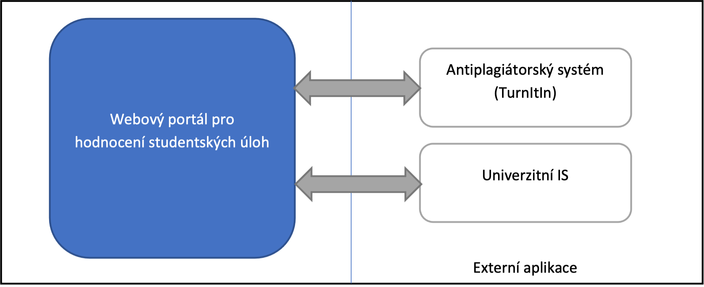
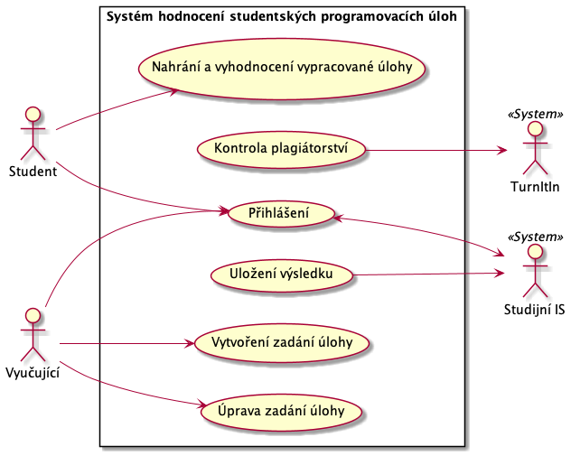

## Problém

Navrhované řešení vychází z potřeby automatizovat hodnocení jednoduchých programátorských úloh na univerzitě.

## Popis systému

V systému vystupují tyto 3 aplikace:

- Webový portál pro hodnocení studentských prog. úloh (navrhovaná aplikace)
  - Umožní studentům nahrávat zdrojový kód k hodnocení.
- Antiplagiátorský systém (externí)
  - Externí služba pro odhalování plagiátorství.
- Univerzitní IS (externí)
  - Systém je dodáván třetí stranou a není jednoduché v něm provádět změny.

## Případy užití

